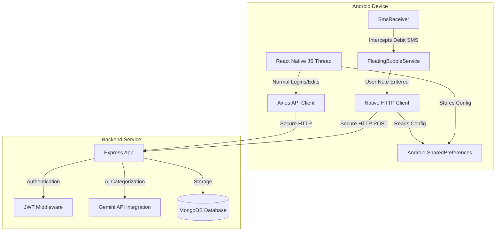

# ExpenseTracker Technical Architecture

ExpenseTracker is a next-generation personal finance assistant combining a **React Native mobile client**, a **Node.js/Express backend**, and **AI-powered transaction logging** via direct background SMS interception.

---

## 1. System Overview

---

## 2. Background SMS Interception Flow

The application handles transactions in real time—even when the mobile application is completely closed or suspended.

### Step 1: Broadcast Listening (`SmsReceiver.kt`)
* The operating system receives a new SMS and forwards it to the statically registered receiver in `AndroidManifest.xml`.
* `SmsReceiver` parses the message body for debit keywords (`debited`, `paid`, `spent`, `sent`).
* If verified, it extracts the transaction amount using regular expression matching and launches the `FloatingBubbleService`.

### Step 2: Overlay Display & UI (`FloatingBubbleService.kt`)
* Draws a system overlay circle containing the application's circular launcher icon.
* We crop the icon to a perfect circle at hardware level using `ViewOutlineProvider` and `clipToOutline = true` to prevent square edges from leaking.
* Tapping the icon slides out a card layout with a transaction note input field.

### Step 3: Direct Native Synchronization
* When the user enters their note and clicks **Done**, the service reads the user's active JSON Web Token and backend server URL from `SharedPreferences` (synced by `AppNavigator.tsx` on login/restore).
* Kotlin fires a background HTTP `POST` request directly to the backend server with `{ amount, note }`.
* Upon a successful database save, a local broadcast (`com.expensetracker.EXPENSE_CREATED`) triggers the JS engine to reload dashboard metrics automatically.

---

## 3. Backend Platform

The backend service is built using Node.js, Express, TypeScript, and MongoDB.

### Core Architecture
* **Authentication:** A custom JWT verification middleware checks the `Authorization` header on every request, populates `req.userId`, and blocks unauthenticated requests.
* **Database Models:**
  * **User:** User credentials and metadata.
  * **Expense:** User-associated expenses consisting of `amount`, `category`, `description`, and `date`.
* **AI Engine:** Integrated with Google Gemini (`gemini-2.5-flash`) via `GoogleGenerativeAI` to clean user notes, preserve merchant/recipient context, and assign transactions to one of five core categories:
  * `Food`
  * `Travel`
  * `Shopping`
  * `Bills`
  * `Other`

### Primary Endpoints
* `POST /api/auth/register` - Create user credentials.
* `POST /api/auth/login` - Authenticate and return JWT token.
* `POST /api/expenses` - Create a new expense. Supports direct `note` input for automatic Gemini categorization.
* `GET /api/expenses` - Query paginated user expenses.
* `DELETE /api/expenses/:id` - Remove an expense.
